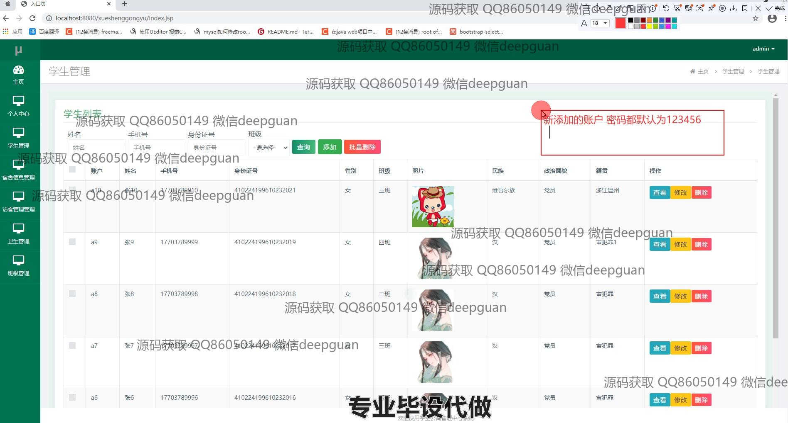
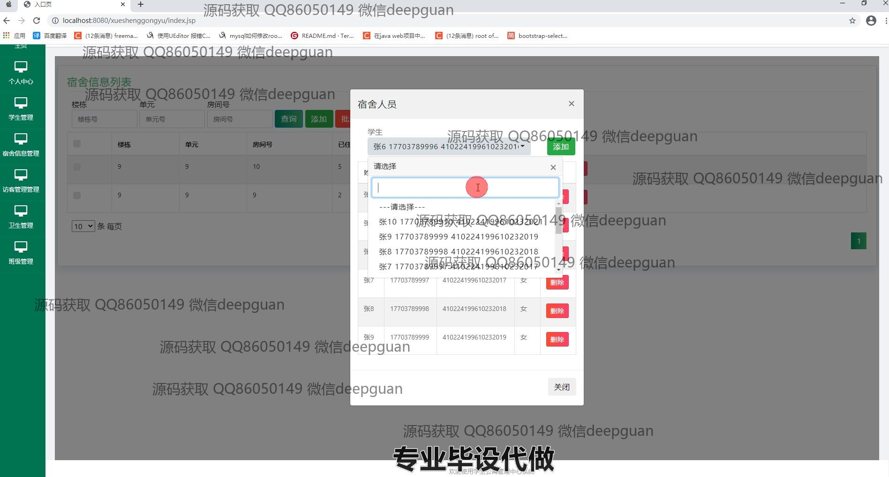
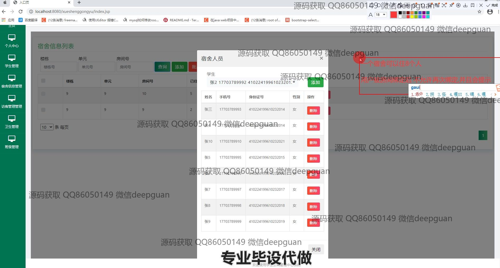

<h1 align="center">学生公寓管理中心系统</h1>

## 简介
学生公寓管理系统：角色分为管理员和用户；功能包括学生管理、宿舍信息管理、访客管理、卫生管理、班级管理、个人中心等模块，支持信息查询、添加、修改、删除，提高管理效率。    --计算机毕业设计源码；毕设源码；java毕业设计源码

## 联系方式

<h3 align="center">获取完整代码与数据库文件 + 微信：deepguan QQ: 86050149 QQ群: 783742310</h3>

<h3 align="center">可帮忙远程部署 包运行成功！提供远程部署、修改代码、设计文档指导、代码讲解等服务！</h3>

## 功能介绍（完整见运行截图）
管理员：管理宿舍信息、学生信息、访客信息和卫生状况等。支持宿舍分配、入住退宿管理、修改密码、费用管理等功能。可以查看、添加、删除和修改学生、班级和访客信息，支持批量操作和信息搜索。确保各模块的数据准确性，提供便捷的管理操作。个人中心中可以进行个人信息管理和密码修改，导航便捷，系统信息反馈及时。

学生用户：查看和管理个人信息及宿舍信息。支持通过姓名、手机号等查询个性化信息。能够查看注册房间和宿舍成员名单，获得关于住宿和个人信息的更新提示。具备基本的信息管理权限，如个人资料编辑。密码修改功能保证账户安全，界面引导简单易懂。系统提供个性化服务和信息反馈。

## 运行截图

本代码来源于网络,仅供学习参考使用!

